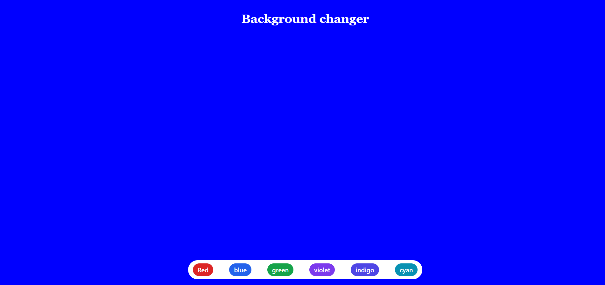

# React + Vite

This template provides a minimal setup to get React working in Vite with HMR and some ESLint rules.

Currently, two official plugins are available:

- [@vitejs/plugin-react](https://github.com/vitejs/vite-plugin-react/blob/main/packages/plugin-react/README.md) uses [Babel](https://babeljs.io/) for Fast Refresh
- [@vitejs/plugin-react-swc](https://github.com/vitejs/vite-plugin-react-swc) uses [SWC](https://swc.rs/) for Fast Refresh

## Projects Overview

### Background Changer 

This project is a simple React application that allows users to change the background color of the webpage by clicking on different color buttons.

#### Features

- **Dynamic Background Color**: Change the background color dynamically by clicking buttons.
- **Responsive Design**: Designed to work well across different screen sizes.
- **Tailwind CSS**: Utilizes Tailwind CSS for styling and responsiveness.

#### Technologies Used

- **React**: Used for building the user interface and managing state.
- **useState Hook**: Manages the state of the background color.
- **Tailwind CSS**: Handles styling with utility-first CSS classes.



#### How to Use

1. Clone the repository:
   ```bash
   git clone https://github.com/Sunnny-yadav/react-learning-projects.git
   cd react-learning-projects/01bgChanger
   ```
2. **Install dependencies**:
   ```bash
   npm install
   ```
3. **Run the development server**:
   ```bash 
   npm run dev
    ```
4. Navigate to localhost link to view you app
