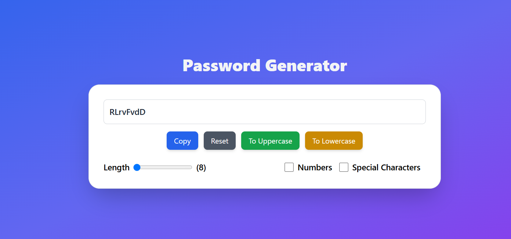

# React + Vite

This template provides a minimal setup to get React working in Vite with HMR and some ESLint rules.

Currently, two official plugins are available:

- [@vitejs/plugin-react](https://github.com/vitejs/vite-plugin-react/blob/main/packages/plugin-react/README.md) uses [Babel](https://babeljs.io/) for Fast Refresh
- [@vitejs/plugin-react-swc](https://github.com/vitejs/vite-plugin-react-swc) uses [SWC](https://swc.rs/) for Fast Refresh

## Projects Overview

### Password Generator

This project is a simple password generator built using React and Tailwind CSS. It allows users to generate passwords based on specified criteria such as length, including numbers and special characters.

#### Features

- **Dynamic Password Generation**: Generates passwords based on specified length and criteria.
- **Copy to Clipboard**: Allows users to copy generated passwords to the clipboard.
- **Reset Functionality**: Resets the password generation.
- **Convert to Uppercase**: Converts the generated password to uppercase letters.


#### Technologies Used

- **React**: Used for building the user interface and managing state.
- **useState Hook**: Manages component state for password length, allowed characters, and generated password.
- **useEffect Hook**: Triggers password generation on component mount and whenever dependencies change.
- **useRef Hook**: Handles reference to the password input field for copy functionality.
- **Tailwind CSS**: Provides utility-first CSS classes for styling the components.


#### How to Use

1. **Clone the repository:**
   ```bash
   git clone https://github.com/Sunnny-yadav/react-learning-projects.git
   cd react-learning-projects/02passwordGenerator
   ```
2. **Install dependencies**:
   ```bash
   npm install
   ```
3. **Run the development server**:
   ```bash  
   npm run dev
    ```
4. Navigate to localhost link to view you app
