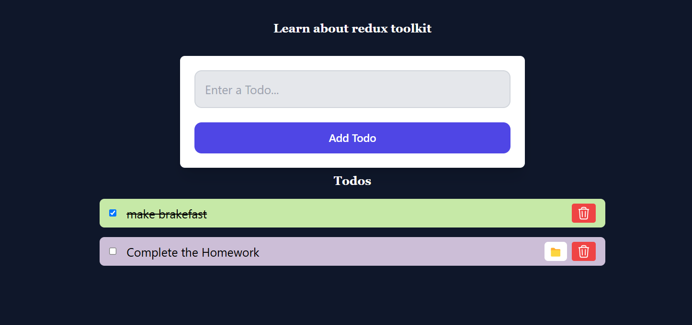

# React Todo List Project with Redux

This project is a web application built using React and Redux, utilizing Redux Toolkit to manage state for a todo list. It demonstrates a simple todo list with functionalities to add, update, toggle status, remove tasks, and more using Redux for state management.

## Features

- **Add Todo**: Allows users to add new tasks to the todo list.
- **Remove Todo**: Enables users to delete tasks from the todo list.
- **Load Todo**: Loads initial todo items into the todo list.
- **Toggle Complete**: Allows users to mark tasks as completed or pending.
- **Toggle Button**: Toggles the update button status for updating todo messages.
- **Update Message**: Updates the message of a selected todo item.
- **Update Icon**: Toggles the icon status of a selected todo item.

## Technologies Used

- **React**: Used for building the user interface and managing component state.
- **Redux Toolkit**: Implements Redux Toolkit for efficient and simplified Redux state management.
- **createSlice**: Defines Redux slice with reducers for managing todo actions.
- **useDispatch Hook**: Dispatches actions to update state in Redux store.
- **CSS**: Basic CSS for styling components.



## Learnings

- **Redux**: Implements Redux Toolkit to manage state for todo items and their statuses.
- **Reducers**: Defines reducers using createSlice to handle actions for adding, updating, toggling status, and removing tasks.
- **Dispatching Actions**: Utilizes useDispatch hook to dispatch actions from components to update Redux store.
- **Immutable State Updates**: Ensures immutability while updating state to prevent bugs and ensure consistency.

## How to Use

1. **Clone the repository:**
   ```bash
   git clone https://github.com/Sunnny-yadav/react-learning-projects.git
   cd react-learning-projects/07todo_redux
2. **Install Dependencis:**
   ```bash
   npm i
   ```
3. **Install Dependencis of Redux:**
   ```bash
   npm install @reduxjs/toolkit
   npm install react-redux 
   ```
4. **Start the development server:**
   ```bash
   npm run dev 
   ```
