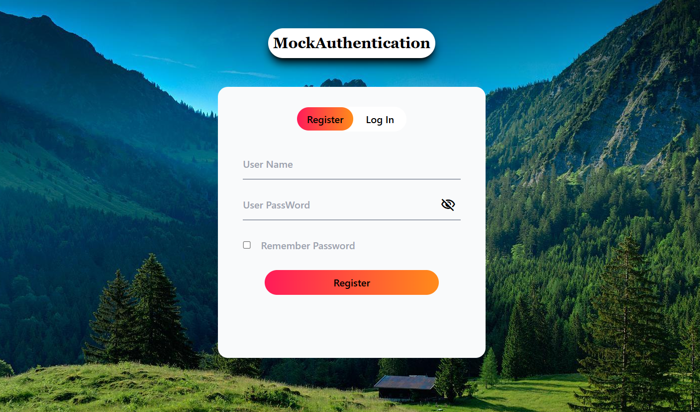
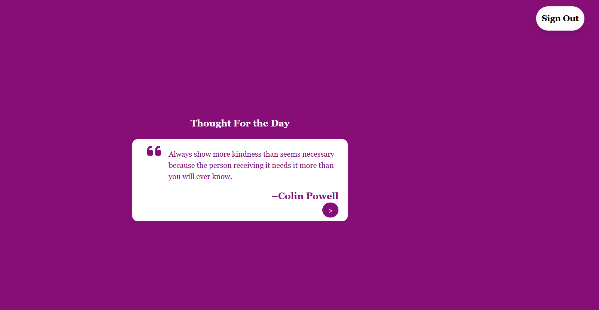

# React + Vite

This template provides a minimal setup to get React working in Vite with HMR and some ESLint rules.

Currently, two official plugins are available:

- [@vitejs/plugin-react](https://github.com/vitejs/vite-plugin-react/blob/main/packages/plugin-react/README.md) uses [Babel](https://babeljs.io/) for Fast Refresh
- [@vitejs/plugin-react-swc](https://github.com/vitejs/vite-plugin-react-swc) uses [SWC](https://swc.rs/) for Fast Refresh

# Mock Authentication with Redux

This project is a simple web application that simulates the login and registration process without a backend. Built with React and Redux, it provides a mock authentication system where users can register, log in, and view a quote after successful login. The authentication flow mimics real-world scenarios, including validation and state handling using Redux and local storage.

## Features

- **User Registration**: Allows users to register by providing a username and password.
- **User Login**: After registration, users can log in with their credentials.
- **Login Validation**: Password validation ensures the correct credentials are used for login.
- **Protected Page**: Upon successful login, users are redirected to a page where a motivational quote is displayed.
- **State Management**: Utilizes Redux for managing authentication state and local storage for persistence.

## Technologies Used

- **React**: Used for building the user interface and handling user interactions.
- **Redux**: Manages authentication state and ensures that login and registration data is handled correctly.
- **Local Storage**: Stores user data (username and password) persistently in the browser.
- **CSS**: Basic CSS for styling the components.




## Learnings

- **Authentication Flow**: Simulates login and registration processes, including form validation and state handling.
- **State Management with Redux**: Manages authentication state, storing user credentials in Redux and local storage.
- **Redirection**: Implements redirection to a protected page after successful login.

## How to Use

1. **Clone the repository**:
   ```bash
   git clone https://github.com/Sunnny-yadav/react-learning-projects.git
   cd react-learning-projects/08mockAuthentication
2. **Install Dependencies:**:
   ```bash
   npm i
3. **Start the development server:**
   ```bash
   npm run dev

